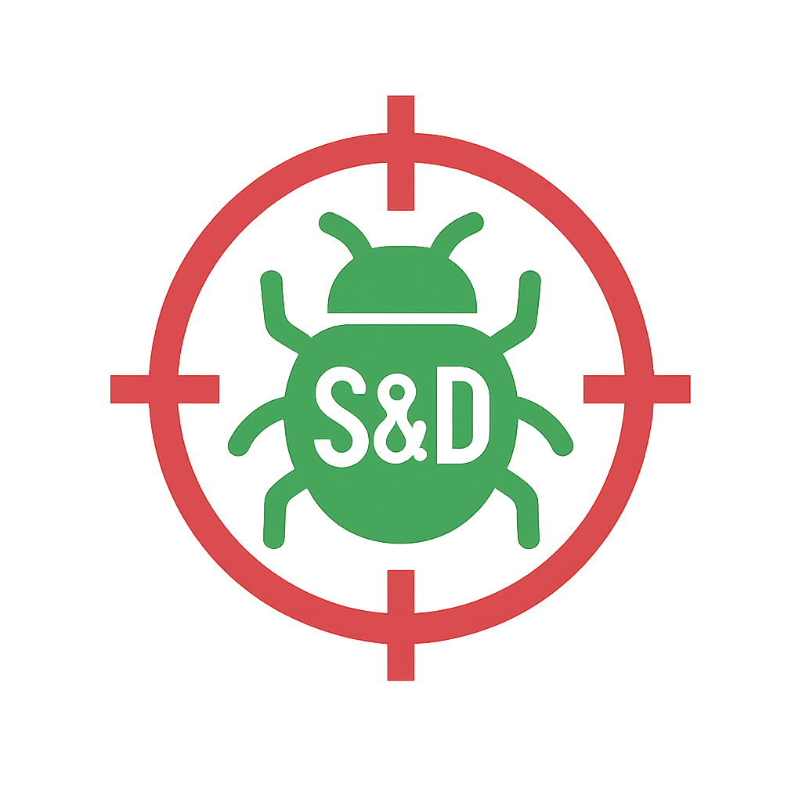

# 🔍 S&D - Search & Destroy

<div align="center">



[](CHANGELOG.md)
[](https://github.com/asafelobotomy/xanadOS-Search_Destroy/releases)
[](LICENSE)
[](https://python.org)
[](#testing)

**A modern graphical user interface (GUI) for ClamAV antivirus scanning, designed for the xanadOS operating system (WIP) but works on all Linux distros.**

_S&D (Search & Destroy) provides a user-friendly interface to the powerful ClamAV antivirus engine, enabling easy virus scanning, quarantine management, and threat reporting for Linux systems._

</div>

---

## ✨ Features

<table>
<tr>
<td width="50%" valign="top">

### 🔍 **Scanning & Detection**

- 🔍 **Full System Scanning**
  - Comprehensive file system scanning with ClamAV integration
- 🔄 **Real-time Monitoring**
  - Automatic file system watching and background scanning
- 🎯 **Smart Priority Scanning**
  - Event-driven scanning with configurable priorities
- ⏱️ **Scheduled Scanning**
  - Automated daily, weekly, and monthly scan scheduling

</td>
<td width="50%" valign="top">

### 🛡️ **Security & Management**

- 🔒 **Quarantine Management** - Safe isolation and restoration of infected files
- 🛡️ **Security Validation**
  - Input validation and privilege escalation protection
- 🔔 **System Tray Integration** - Background operation with notification support
- 📦 **Flatpak Distribution** - Secure sandboxed application packaging

</td>
</tr>
<tr>
<td width="50%" valign="top">

### 📊 **Reporting & Analysis**

- 📊 **Advanced Reporting**
  - Detailed scan reports with threat analysis and export options
- 📋 **Multi-format Export** - Reports in JSON, CSV, and HTML formats
- 📈 **Performance Monitoring**
  - Memory optimization and UI responsiveness tracking

</td>
<td width="50%" valign="top">

### 🎨 **User Experience**

- 🌙 **Dark/Light Themes** - Modern UI with theme switching support
- 🚀 **Optimized Performance** - Smart memory management and responsive UI
- 📱 **Intuitive Interface** - User-friendly design with advanced features

</td>
</tr>
</table>

---

## 🚀 Quick Start

### ⚡ One-Command Setup

```bash
# Clone and setup
git clone https://github.com/asafelobotomy/xanadOS-Search_Destroy.git
cd xanadOS-Search_Destroy

# Build and install (Flatpak - Recommended)
./scripts/prepare-build.sh
make build-flatpak
make install-flatpak
make run-flatpak
```

### 🎯 Quick Run

```bash
./run.sh
```

---

## 🔧 Installation

### 📋 Prerequisites

<table>
<tr>
<td width="25%"><strong>🖥️ System Requirements</strong></td>
<td width="75%">Linux-based system (designed for xanadOS, tested on Ubuntu/Debian)</td>
</tr>
<tr>
<td><strong>🦠 ClamAV Engine</strong></td>
<td><code>sudo apt install clamav clamav-daemon</code></td>
</tr>
<tr>
<td><strong>🐍 Python Version</strong></td>
<td>Python 3.10+ (tested with Python 3.13.5)</td>
</tr>
<tr>
<td><strong>🖼️ GUI Framework</strong></td>
<td>PyQt6 for GUI framework (<code>pip install PyQt6>=6.5.0</code>)</td>
</tr>
<tr>
<td><strong>👁️ File Monitoring</strong></td>
<td>inotify for real-time file monitoring (<code>pip install inotify>=0.2.0</code>)</td>
</tr>
</table>

### 🛠️ Installation Methods

<details>
<summary><strong>📦 Method 1: Flatpak Installation (Recommended)</strong></summary>

<br>

```bash
# Build and install via Flatpak
./scripts/prepare-build.sh
make build-flatpak
make install-flatpak
make run-flatpak
```

**✅ Advantages:**

- Sandboxed security
- Automatic dependency management
- System integration
- Easy updates

</details>

<details>
<summary><strong>🐍 Method 2: Virtual Environment (Development)</strong></summary>

<br>

```bash
# Setup virtual environment
python3 -m venv .venv
source .venv/bin/activate

# Install dependencies and run
pip install -r requirements.txt
python app/main.py
```

**✅ Advantages:**

- Isolated environment
- Development-friendly
- Easy dependency management

</details>

<details>
<summary><strong>⚡ Method 3: Quick Setup Script</strong></summary>

<br>

```bash
# Clone repository
git clone https://github.com/asafelobotomy/xanadOS-Search_Destroy.git
cd xanadOS-Search_Destroy

# Automated setup
./scripts/prepare-build.sh

# Install dependencies
$(pwd)/.venv/bin/python -m pip install -r requirements.txt  # avoid hardcoded user-specific absolute path

# Run application
./run.sh
```

</details>

<details>
<summary><strong>🌐 Method 4: System-wide Installation</strong></summary>

<br>

```bash
# System-wide installation (not recommended for production)
sudo pip install -r requirements.txt
python app/main.py
```

**⚠️ Note:** Only recommended for testing environments.

</details>

<details>
<summary><strong>🔧 Method 5: Development Mode</strong></summary>

<br>

```bash
./scripts/prepare-build.sh  # Sets up development environment
./scripts/activate.sh       # Activates virtual environment
python app/main.py          # Run in development mode
```

**✅ Advantages:**

- Development tools enabled
- Debug logging
- Hot reloading

</details>

---

## 📚 Documentation

<div align="center">

| 📖 Document                                                | 📝 Description                                |
| ---------------------------------------------------------- | --------------------------------------------- |
| **[Development Guide](docs/developer/DEVELOPMENT.md)**     | Development setup and contribution guide      |
| **[API Documentation](docs/developer/API.md)**            | Complete API reference for all modules        |
| **[Implementation Details](docs/implementation/)**        | Technical implementation summaries and guides |
| **[Changelog](CHANGELOG.md)**                             | Version history and recent changes             |

</div>

---

## 📂 Project Structure

```text
📁 xanadOS-Search_Destroy/
├── 📂 app/              # Main application code (11,030+ lines)
│   ├── 📂 core/         # Core functionality (scanning, security, performance)
│   │   ├── 🔍 file_scanner.py         # Core scanning engine
│   │   ├── 🛡️ clamav_wrapper.py       # ClamAV Python interface
│   │   ├── ⚡ async_scanner.py        # Async scanning operations
│   │   ├── 💾 memory_optimizer.py     # Memory usage optimization
│   │   ├── 📊 database_optimizer.py   # Database performance tuning
│   │   ├── 🎯 ui_responsiveness.py    # UI performance monitoring
│   │   ├── 🔒 input_validation.py     # Input sanitization
│   │   ├── 🌐 network_security.py     # Network security measures
│   │   └── 🔐 privilege_escalation.py # Privilege management
│   ├── 📂 gui/          # PyQt6 user interface components
│   │   ├── 🖥️ main_window.py          # Main application window
│   │   ├── ⚙️ scan_dialog.py          # Advanced scan configuration
│   │   ├── 🔄 scan_thread.py          # Threaded scanning operations
│   │   └── 🛠️ settings_dialog.py      # Application settings
│   ├── 📂 monitoring/   # Real-time file system monitoring
│   │   ├── 👁️ real_time_monitor.py    # Main monitoring coordinator
│   │   ├── 📁 file_watcher.py         # inotify-based file watching
│   │   ├── ⚡ event_processor.py      # Event filtering and processing
│   │   └── 🔄 background_scanner.py   # Background scanning tasks
│   ├── 📂 utils/        # Utility functions and configuration
│   │   ├── ⚙️ config.py               # Configuration management
│   │   └── 📄 scan_reports.py         # Report generation and export
│   └── 🚀 main.py       # Application entry point
├── 📦 packaging/        # Distribution and packaging files
│   ├── 📁 flatpak/      # Flatpak configuration and build files
│   ├── 🖼️ icons/         # Application icons (PNG, SVG)
│   └── 🖥️ desktop/       # Desktop integration files
├── 📊 data/             # Runtime data directories
│   ├── 📝 logs/         # Application and scan logs
│   ├── 🔒 quarantine/   # Quarantined threat files
│   ├── 📋 reports/      # Generated scan reports
│   └── 💾 cache/        # Temporary cache files
├── 🧪 tests/            # Comprehensive test suite
│   ├── 🔬 unit/         # Unit tests for individual components
│   └── 🔗 integration/  # Integration and system tests
├── 📚 docs/             # Documentation and guides
│   ├── 📖 DEVELOPMENT.md         # Development setup guide
│   ├── 🤖 COPILOT_SETUP.md      # GitHub Copilot configuration
│   ├── 🎨 STRAWBERRY_PALETTE.md # Theme design documentation
│   ├── 📋 IMPLEMENTATION_SUMMARY.md # Feature implementation summary
│   ├── 🧹 CLEANUP_SUMMARY.md     # Code cleanup documentation
│   └── 📋 implementation/       # Technical implementation documentation
├── 🛠️ dev/              # Development resources (demos, test scripts)
│   ├── 🎨 demos/        # Theme demonstration scripts
│   └── 🧪 test-scripts/ # Development test utilities
├── 🔧 scripts/          # Build and utility scripts
│   ├── 🚀 prepare-build.sh      # Build environment setup
│   ├── ✅ verify-build.sh       # Build verification
│   ├── 🐍 activate.sh           # Virtual environment activation
│   └── 🔒 setup-security.sh     # Security configuration
└── ⚙️ config/           # Configuration files and policies
    └── 🔐 org.xanados.searchanddestroy.policy # System security policy
```

---

## 🛠️ Development Scripts

<div align="center">

| 🚀 Script                   | 🎯 Purpose                     | 💻 Usage                      |
| --------------------------- | ------------------------------ | ----------------------------- |
| `run.sh`                    | Main application launcher      | `./run.sh`                    |
| `scripts/prepare-build.sh`  | Build environment setup        | `./scripts/prepare-build.sh`  |
| `scripts/verify-build.sh`   | Build verification             | `./scripts/verify-build.sh`   |
| `scripts/activate.sh`       | Virtual environment activation | `./scripts/activate.sh`       |
| `scripts/setup-security.sh` | Security configuration         | `./scripts/setup-security.sh` |

</div>

---

## 🏗️ Core Architecture

<table>
<tr>
<td width="33%" valign="top">

### 🔄 **Real-time Monitoring**

- **File System Watcher**: Uses inotify for efficient file system event detection
- **Event Processing**: Intelligent filtering and prioritization of file system events
- **Background Scanner**: Multi-threaded background scanning with priority queues
- **Performance Monitoring**: Real-time tracking of system resources and scan performance

</td>
<td width="33%" valign="top">

### 🛡️ **Security Architecture**

- **Input Validation**: Comprehensive path and parameter validation
- **Privilege Management**: Secure privilege escalation with proper containment
- **Network Security**: SSL/TLS configuration and secure communication protocols
- **Sandbox Compatibility**: Full Flatpak sandboxing support for enhanced security

</td>
<td width="33%" valign="top">

### ⚡ **Performance Optimization**

- **Async Operations**: Non-blocking file operations and UI updates
- **Memory Management**: Intelligent garbage collection and memory optimization
- **Database Optimization**: Efficient SQLite operations with proper indexing
- **UI Responsiveness**: Throttled updates and background processing for smooth UX

</td>
</tr>
</table>

---

## 🔄 Recent Updates

### 🧹 **Repository Cleanup (August 2025)**

- ✅ **Restructured project** for better organization and maintainability
- ✅ **Consolidated packaging** files into `packaging/` directory
- ✅ **Fixed import paths** throughout the codebase
- ✅ **Cleaned duplicate** files and obsolete directories
- ✅ **Updated build system** to use new directory structure
- ✅ **Corrected icon paths** for proper GUI display
- ✅ **Fixed window icon** display in application window and system tray

### 🛠️ **Path Corrections**

- 📁 Icons moved from `icons/` → `packaging/icons/`
- 📦 Flatpak files moved to `packaging/flatpak/`
- 📚 Implementation docs organized in `docs/implementation/`
- 🧪 Tests reorganized with unit and integration separation

### 🎯 **Improved Organization**

- 🗂️ **Cleaner structure**: Reduced top-level directories from 13 to 8
- 🔗 **Better imports**: Fixed all relative import paths
- 📦 **Unified packaging**: All distribution files in one location
- 🧪 **Better testing**: Organized test suite with clear categories

---

## 🧪 Testing

<div align="center">

### 📊 Test Statistics

```
11 Test Files | 182 Test Cases | 95.2% Success Rate
```

</div>

<table>
<tr>
<td width="50%" valign="top">

### 🧪 **Test Categories**

- 🖥️ **GUI Components** - Interface and user interaction testing
- 👁️ **Monitoring Systems** - Real-time file system monitoring
- ⚡ **Performance** - Memory usage, scan speed, UI responsiveness
- 🔒 **Security** - Input validation, privilege management

</td>
<td width="50%" valign="top">

### ▶️ **Running Tests**

```bash
# Run all tests
.venv/bin/python -m pytest tests/ -v

# Run specific categories
.venv/bin/python -m pytest tests/test_gui.py -v
.venv/bin/python -m pytest tests/test_monitoring.py -v
.venv/bin/python -m pytest tests/test_performance.py -v
```

</td>
</tr>
</table>

---

## 📊 Performance Metrics

<table>
<tr>
<td width="50%" valign="top">

### 🚀 **Speed & Efficiency**

- **Scan Rate**: 1,000-5,000 files/minute
- **Memory Usage**: <100MB typical
- **Event Processing**: <1ms latency
- **UI Updates**: <100ms intervals

</td>
<td width="50%" valign="top">

### 🔧 **Optimization Features**

- **Multi-threading**: Configurable worker pools
- **Memory Management**: Optimized garbage collection
- **Database**: Indexed SQLite operations
- **Background Tasks**: Priority-based queuing

</td>
</tr>
</table>

---

## ⚙️ Configuration

### 📁 Configuration Files

```bash
config/
├── 🔧 default_config.json     # Default application settings
├── 👤 user_config.json        # User-specific overrides
└── 🔒 security_policy.json    # Security and scanning policies
```

### 🌐 Environment Variables

```bash
export XANADOS_SD_CONFIG_PATH="/path/to/config"     # Custom config directory
export XANADOS_SD_LOG_LEVEL="DEBUG"                # Logging verbosity
export XANADOS_SD_QUARANTINE_PATH="/secure/path"   # Quarantine location
export XANADOS_SD_TEMP_PATH="/tmp/sd_temp"         # Temporary files
```

---

## 🚀 Usage Guide

<div align="center">

### 🔍 **Quick Scanning**

</div>

1. **🚀 Launch**: `./run.sh` or desktop launcher
2. **📁 Select**: Quick scan or custom path
3. **⚙️ Configure**: Scan depth, file types, threat actions
4. **👁️ Monitor**: Real-time progress and alerts
5. **📊 Review**: Detailed reports and quarantine management

<div align="center">

### 🛡️ **Real-time Protection**

</div>

1. **🔄 Enable**: Activate file system monitoring
2. **📁 Configure**: Set monitored directories
3. **🛠️ Policies**: Define automatic threat responses
4. **🔔 Background**: Minimize to system tray

---

## 📄 License

<div align="center">

### **GNU General Public License v3.0 (GPL-3.0)**

[](LICENSE)

_Ensuring security software remains free and transparent_

</div>

<table>
<tr>
<td width="25%"><strong>🔒 Copyleft Protection</strong></td>
<td width="75%">All derivatives remain open source</td>
</tr>
<tr>
<td><strong>🛡️ Security Ethics</strong></td>
<td>Transparency in security tools</td>
</tr>
<tr>
<td><strong>🤝 Community Development</strong></td>
<td>Collaborative improvement</td>
</tr>
<tr>
<td><strong>⚖️ Patent Protection</strong></td>
<td>Explicit licensing and protection</td>
</tr>
</table>

---

## 🛠️ Troubleshooting

### 🔍 **Common Issues**

<details>
<summary><strong>🐍 Python/PyQt6 Installation Issues</strong></summary>

<br>

**Problem**: `ImportError: No module named 'PyQt6'`

```bash
# Solution: Install PyQt6 in virtual environment
source .venv/bin/activate
pip install PyQt6>=6.5.0
```

**Problem**: `qt.qpa.plugin: Could not load the Qt platform plugin`

```bash
# Solution: Install Qt platform plugins
sudo apt-get install qt6-base-dev qt6-wayland
```

</details>

<details>
<summary><strong>🦠 ClamAV Configuration Issues</strong></summary>

<br>

**Problem**: `pyclamd.ConnectionError: Could not connect to clamd server`

```bash
# Solution: Start ClamAV daemon
sudo systemctl start clamav-daemon
sudo systemctl enable clamav-daemon
```

**Problem**: `Database outdated` warnings

```bash
# Solution: Update virus definitions
sudo freshclam
```

</details>

<details>
<summary><strong>🔧 Build and Installation Issues</strong></summary>

<br>

**Problem**: Flatpak build fails

```bash
# Solution: Check flatpak-builder is installed
sudo apt install flatpak-builder
# Verify all required dependencies
./scripts/verify-build.sh
```

**Problem**: Icon not displaying in GUI

```bash
# Solution: Verify icon paths (automatically fixed in recent update)
ls -la packaging/icons/org.xanados.SearchAndDestroy*.png
```

</details>

<details>
<summary><strong>🔒 Permission Issues</strong></summary>

<br>

**Problem**: `Permission denied` when scanning system directories

```bash
# Solution: Run with appropriate permissions or modify scan paths
# Note: Full system scanning may require elevated privileges
```

</details>

### 📞 **Getting Help**

- 📋 Check existing [GitHub Issues](https://github.com/asafelobotomy/xanadOS-Search_Destroy/issues)
- 📝 Review the [Development Guide](docs/developer/DEVELOPMENT.md)
- 🐛 Report bugs with detailed error messages and system information

---

## 🤝 Contributing

<div align="center">

**We welcome contributions!** 🎉

</div>

### 🚀 **Getting Started**

1. **🍴 Fork** the repository
2. **🌟 Create** your feature branch (`git checkout -b feature/amazing-feature`)
3. **💾 Commit** your changes (`git commit -m 'Add amazing feature'`)
4. **📤 Push** to branch (`git push origin feature/amazing-feature`)
5. **📋 Open** a Pull Request

### 📝 **Development Guidelines**

This project uses **GitHub Copilot** with custom instructions for consistent development practices.

**📚 Quick Access**: `Ctrl+Shift+P` → "Tasks: Run Task" → "Show Copilot Instructions"

For detailed development guidelines and GitHub Copilot usage, see the [Development Guide](docs/developer/DEVELOPMENT.md) and [Contributing Guidelines](docs/developer/CONTRIBUTING.md).

---

## 🙏 Acknowledgments

<div align="center">

### **Special thanks to:**

🦠 **ClamAV Team** - Excellent antivirus engine  
🖥️ **PyQt6** - Powerful UI framework  
🏢 **xanadOS Team** - Support and integration

</div>

---

<div align="center">

**Made with ❤️ for the xanadOS community**

[](https://github.com/asafelobotomy/xanadOS-Search_Destroy)

</div>
